<div align="center">


</div>

<br/>

# Security engineer in the making.

I build at the intersection of cybersecurity, intelligent systems, and software engineering — exploring how secure infrastructure, automation, and AI combine into systems that are both resilient and useful.

`CYBERSECURITY` &nbsp;·&nbsp; `AI SECURITY` &nbsp;·&nbsp; `SOFTWARE ENGINEERING` &nbsp;·&nbsp; `COMPUTER ENGINEERING`


## System status

| | |
|---|---|
| 🟡 **BUILDING** | Security projects |
| 🟡 **LEARNING** | Advanced penetration testing |
| 🟡 **EXPLORING** | Bug bounty / web security |
| 🟡 **RESEARCHING** | AI × cybersecurity |


## Capability matrix

**SECURITY**
Linux · Kali Linux · Penetration Testing · Web Security · Honeypots · Threat Monitoring

**ENGINEERING**
Python · Java · React · FastAPI · Flask · SQL

**INFRASTRUCTURE**
Docker · Git · GitHub Actions · CI/CD · PostgreSQL · DevSecOps

**INTELLIGENCE**
Machine Learning · AI Security · Automation · Security Analytics · Threat Intelligence


<div align="center">



</div>

<br/>

## Selected operations

**01 · IoT Deception Honeypot**
A deception-technology testbed for observing real attacker behavior against exposed IoT-style services.
`Cowrie` `Docker` `Grafana` `Loki` `Linux`
- Deployed Cowrie as a low/medium-interaction honeypot
- Centralized logs and built live dashboards for attack monitoring
- Used Grafana + Loki for threat analysis of captured sessions

**02 · SecureShield AI**
An AI-assisted security analysis service for triaging and investigating threats.
`Python` `FastAPI` `PostgreSQL` `Docker` `AI`
- FastAPI backend for structured security analysis workflows
- PostgreSQL-backed threat intelligence storage
- AI-assisted investigation to accelerate analyst triage

**03 · Student Performance Predictor**
A full-stack ML application with role-based dashboards.
`Python` `Machine Learning` `Flask` `React`
- Flask + React application with authentication
- Separate student and teacher dashboards
- ML model driving performance predictions

**04 · Enterprise IaC Pipeline**
A DevSecOps pipeline treating infrastructure as versioned, tested code.
`Docker` `GitHub Actions` `CI/CD` `IaC`
- Infrastructure as Code across environments
- CI/CD via GitHub Actions
- Security checks folded into the pipeline, not bolted on after


## Contribution activity

<div align="center">


</div>

<sub>Refreshed daily from public GitHub contribution data — see <a href="./scripts">/scripts</a>.</sub>


## Credentials

**01 · Google Cybersecurity Certificate**
Security fundamentals · Linux · Networking · Threat analysis · Incident response · Security operations

**02 · Cybersecurity Internship — InfoTact Solutions**
Deception technology · Security monitoring · Infrastructure · Threat analysis · Hands-on cybersecurity work


## Current mission

```
ADVANCED PENETRATION TESTING   ████████░░  BUILDING
BUG BOUNTY / WEB SECURITY      ██████░░░░  EXPLORING
AI × CYBERSECURITY             ███████░░░  BUILDING
SECURITY ENGINEERING           ████████░░  ACTIVE
```


## Engineering philosophy

```
BUILD BEFORE CLAIMING EXPERTISE.

UNDERSTAND THE ATTACK
BEFORE DESIGNING THE DEFENSE.

AUTOMATE REPETITION.
INVESTIGATE ANOMALIES.

SECURITY SHOULD BE STRONG
WITHOUT BECOMING UNUSABLE.
```


<div align="center">

### HAVE AN INTERESTING SECURITY PROBLEM?

Let's build something worth defending.

[](https://www.linkedin.com/in/krish-gajera-2b03a43b9)
[](https://github.com/krishgajera-06)

<br/>

**KRISH GAJERA**
CYBERSECURITY × ENGINEERING × AI
SURAT, INDIA

BUILD WHAT OTHERS TRUST.

</div>
