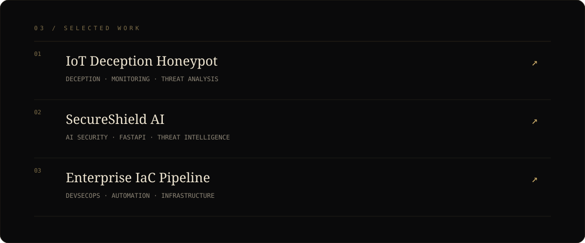

<div align="center">



<br>

<a href="https://github.com/krishgajera-06"></a>
&nbsp;
<a href="https://www.linkedin.com/in/krish-gajera-2b03a43b9"></a>

<br><br>



<br><br>



<br><br>



</div>

<br>

## `04 / GITHUB INTELLIGENCE`

<div align="center">


<br>


</div>

<br>

## `05 / CREDENTIALS`

<table>
<tr>
<td width="50%" valign="top">

### ◇ Google Cybersecurity

Security fundamentals, Linux, networking, threat analysis, incident response and security operations.

`SECURITY` `LINUX` `NETWORKING`

</td>
<td width="50%" valign="top">

### ◇ Cybersecurity Internship

Hands-on security work involving deception technology, monitoring, infrastructure and threat analysis.

`MONITORING` `DECEPTION` `ANALYSIS`

</td>
</tr>
</table>

<br>

## `06 / CURRENT MISSION`

```text
01  ADVANCED PENETRATION TESTING    ███████░░░  BUILDING
02  BUG BOUNTY / WEB SECURITY       ██████░░░░  EXPLORING
03  AI × CYBERSECURITY              ███████░░░  BUILDING
04  SECURITY ENGINEERING            ████████░░  ACTIVE
```

<br>

<div align="center">

### `OPEN TO BUILDING THINGS THAT MATTER.`

Cybersecurity · Engineering · AI · Open Source

<br>

<a href="https://www.linkedin.com/in/krish-gajera-2b03a43b9"><b>LINKEDIN ↗</b></a>
&nbsp;&nbsp;&nbsp;&nbsp;&nbsp;
<a href="https://github.com/krishgajera-06"><b>GITHUB ↗</b></a>

<br><br>

<sub>KRISH GAJERA · SURAT, INDIA · 2026</sub>

<br><br>

**`ENGINEER THE UNKNOWN.`**

</div>
