 

&nbsp;

 

<table>
<tr>
<td width="18%" valign="top">01 / PROFILE</td>
<td width="82%">

## Security engineer in the making.

I build at the intersection of **cybersecurity, intelligent systems and software engineering** — exploring how secure infrastructure, automation and AI can create systems that are both resilient and useful.

`Computer Engineering` &nbsp; `Cybersecurity` &nbsp; `AI Security` &nbsp; `Software Engineering`

</td>
</tr>
</table>

 

 

 

<table>
<tr>
<td width="18%" valign="top">04 / GITHUB</td>
<td width="82%">

## Engineering in public.

 

</td>
</tr>
</table>

 

<table>
<tr>
<td width="18%" valign="top">05 / CREDENTIALS</td>
<td width="82%">

### Google Cybersecurity
Security fundamentals · Linux · networking · threat analysis · incident response · security operations

### Cybersecurity Internship
Hands-on work across deception technology, monitoring, infrastructure and threat analysis.

</td>
</tr>
</table>

 

<table>
<tr>
<td width="18%" valign="top">06 / NOW</td>
<td width="82%">

## Current direction.

`01` &nbsp; Advanced penetration testing  
`02` &nbsp; Bug bounty & web security  
`03` &nbsp; AI × cybersecurity  
`04` &nbsp; Production-grade security projects

</td>
</tr>
</table>

  

ESTABLISH CONNECTION

  

<a href="https://www.linkedin.com/in/krish-gajera-2b03a43b9"><b>LINKEDIN ↗</b></a>
&nbsp;&nbsp;&nbsp;&nbsp;
<a href="https://github.com/krishgajera-06"><b>GITHUB ↗</b></a>

   

### `ENGINEER THE UNKNOWN.`

KRISH GAJERA · SURAT, INDIA · 2026

