 

Computer Engineering student working across cybersecurity, software engineering and intelligent systems.

`OFFENSIVE SECURITY` &nbsp;·&nbsp; `SECURITY ENGINEERING` &nbsp;·&nbsp; `AI × CYBERSECURITY` &nbsp;·&nbsp; `DEVSECOPS`

### 01 / IDENTITY

# SECURITY IS NOT A FEATURE.
# IT IS AN ENGINEERING DISCIPLINE.

**OFFENSIVE** — Kali · Web Security · Pentesting · Honeypots
**ENGINEERING** — Python · Java · React · FastAPI
**INFRASTRUCTURE** — Docker · GitHub Actions · CI/CD · DevSecOps
**INTELLIGENCE** — Machine Learning · AI Security · Automation · Threat Analysis

### 02 / SELECTED OPERATIONS

A deception environment for observing real attacker behavior against exposed IoT-style services.
- Cowrie deployed as a low/medium-interaction honeypot
- Centralized logs into live Grafana + Loki dashboards
- Attack sessions studied for threat analysis

[Repository ↗](https://github.com/krishgajera-06)

An AI-assisted security analysis service for triaging and investigating threats.
- FastAPI backend for structured analysis workflows
- PostgreSQL-backed threat intelligence storage
- AI-assisted investigation to accelerate analyst triage

[Repository ↗](https://github.com/krishgajera-06)

A full-stack ML application with role-based dashboards.
- Flask + React application with authentication
- Separate student and teacher dashboards
- ML model driving performance predictions

[Repository ↗](https://github.com/krishgajera-06)

A DevSecOps pipeline treating infrastructure as versioned, tested code.
- Infrastructure as Code across environments
- CI/CD via GitHub Actions
- Security checks built into the pipeline, not bolted on after

[Repository ↗](https://github.com/krishgajera-06)

Refreshed daily from public GitHub contribution data — see <a href="./scripts">/scripts</a>.

### 03 / VERIFIED CREDENTIALS

| | |
|---|---|
| **GOOGLE CYBERSECURITY**   `STATUS · COMPLETED` | **INFOTACT SOLUTIONS**   `CYBERSECURITY INTERNSHIP` |
| Security · Networking · Linux · Incident Response | Deception · Monitoring · Infrastructure · Threat Analysis |

# UNDERSTAND THE ATTACK.
# ENGINEER THE DEFENSE.
# AUTOMATE THE REST.

Build before claiming expertise. Investigate anomalies. Security should be strong without becoming unusable.

