<div align="center">



<br>

<a href="https://github.com/krishgajera-06"></a>
<a href="https://www.linkedin.com/in/krish-gajera-2b03a43b9"></a>

<br><br>


</div>

## `01 // SYSTEM_PROFILE`

<table>
<tr>
<td width="50%" valign="top">

### `krish@kali:~$ whoami`

```yaml
name: Krish Gajera
role: Computer Engineering Student
focus:
  - Cybersecurity
  - Ethical Hacking
  - AI Security
  - Software Engineering
mindset: Build • Break • Secure • Learn
```

</td>
<td width="50%" valign="top">

### `status --live`

```diff
+ Building real-world security projects
+ Learning penetration testing
+ Exploring bug bounty
+ Working with Linux & Docker
+ Combining AI with cybersecurity
! Always learning
```

</td>
</tr>
</table>

## `02 // TECH_ARSENAL`

<div align="center">


<br>


<br><br>

`Cowrie` • `Grafana` • `Loki` • `Honeypots` • `Threat Monitoring` • `Network Security` • `DevSecOps`

</div>

## `03 // FEATURED_OPERATIONS`

<table>
<tr>
<td width="50%" valign="top">

### 🍯 IoT Deception Honeypot
**Deception-driven attack monitoring environment**

`Cowrie` `Docker` `Grafana` `Loki` `Linux`

- Captures malicious SSH activity
- Centralized attack logging
- Visual threat monitoring
- Attacker behavior analysis

</td>
<td width="50%" valign="top">

### 🛡️ SecureShield AI
**AI-assisted cybersecurity analysis platform**

`Python` `FastAPI` `PostgreSQL` `Docker` `AI`

- Automated security analysis
- Threat intelligence workflows
- Security-focused backend APIs
- AI-assisted investigation

</td>
</tr>
<tr>
<td width="50%" valign="top">

### 🧠 Student Performance Predictor
**Machine-learning prediction platform**

`Python` `ML` `Flask` `React`

- Academic performance prediction
- Student & teacher dashboards
- Authentication
- ML-powered insights

</td>
<td width="50%" valign="top">

### ⚙️ Enterprise IaC Pipeline
**Infrastructure automation & DevSecOps**

`IaC` `Docker` `GitHub Actions` `DevOps`

- Automated infrastructure workflows
- CI/CD pipeline concepts
- Repeatable deployments
- DevSecOps practices

</td>
</tr>
</table>

## `04 // GITHUB_INTELLIGENCE`

<div align="center">


<br>


<br>


</div>

## `05 // SNAKE.EXE`

<div align="center">

<picture>
  <source media="(prefers-color-scheme: dark)" srcset="https://raw.githubusercontent.com/krishgajera-06/krishgajera-06/output/github-contribution-grid-snake-dark.svg">
  <source media="(prefers-color-scheme: light)" srcset="https://raw.githubusercontent.com/krishgajera-06/krishgajera-06/output/github-contribution-grid-snake.svg">
  
</picture>

</div>

## `06 // SECURITY_CREDENTIALS`

<table>
<tr>
<td width="50%" valign="top">

### 🛡 Google Cybersecurity
Security fundamentals, Linux, networking, threat analysis, incident response and security operations.

</td>
<td width="50%" valign="top">

### 💼 Cybersecurity Internship
Hands-on security work involving deception technology, monitoring, infrastructure and threat analysis.

</td>
</tr>
</table>

## `07 // CURRENT_MISSION`

```text
krish@kali:~$ cat objectives.txt

[01] Advanced Penetration Testing       [██████████░░] LEARNING
[02] Bug Bounty Hunting                 [████████░░░░] EXPLORING
[03] AI × Cybersecurity                 [█████████░░░] BUILDING
[04] Production Security Projects       [██████████░░] ACTIVE

STATUS: ONLINE
MODE:   BUILD → BREAK → ANALYZE → SECURE → REPEAT
```

## `08 // ESTABLISH_CONNECTION`

<div align="center">

<a href="https://www.linkedin.com/in/krish-gajera-2b03a43b9"></a>
<a href="https://github.com/krishgajera-06"></a>

<br><br>


<br><br>

### `> BUILD • BREAK • SECURE • LEARN • REPEAT_`

</div>
