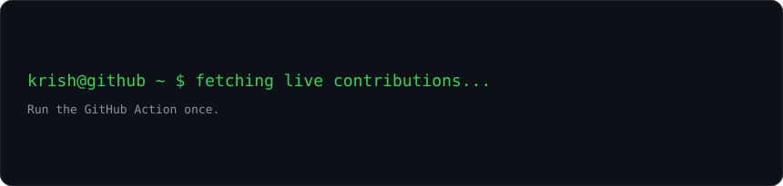

### `krish@github ~ $ ./contributions.sh`

  

### `krish@github ~ $ whoami`
<table><tr>
<td valign="top"></td>
<td valign="top"></td>
</tr></table>

 

### `krish@github ~ $ cat mission.txt`
`Cybersecurity • Ethical Hacking • AI • Software Engineering`

`Build. Secure. Learn. Repeat.`

